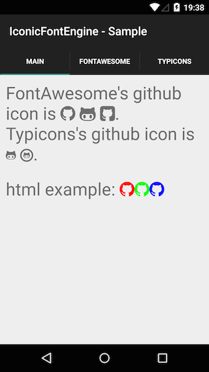

# IconicFontEngine for Android [  ](https://bintray.com/bintray/jcenter/IconicFontEngine/_latestVersion)


This library renders iconic fonts in TextView.



# Install

```gradle
dependencies {
  compile 'com.github.hotchpotch:iconic-font-engine:+'
}
```

# Usage

```xml
<com.github.hotchpotch.iconicfontengine.widget.IconicFontTextView
    android:layout_width="match_parent"
    android:layout_height="wrap_content"
    android:layout_margin="10dp"
    android:textSize="30sp"
    android:text="FontAwesome's github icon is {fa-github}"
    />
```

See [sample_app](sample_app) to initialize font engines.

# License

See [LICENSE.txt](LICENSE.txt).
